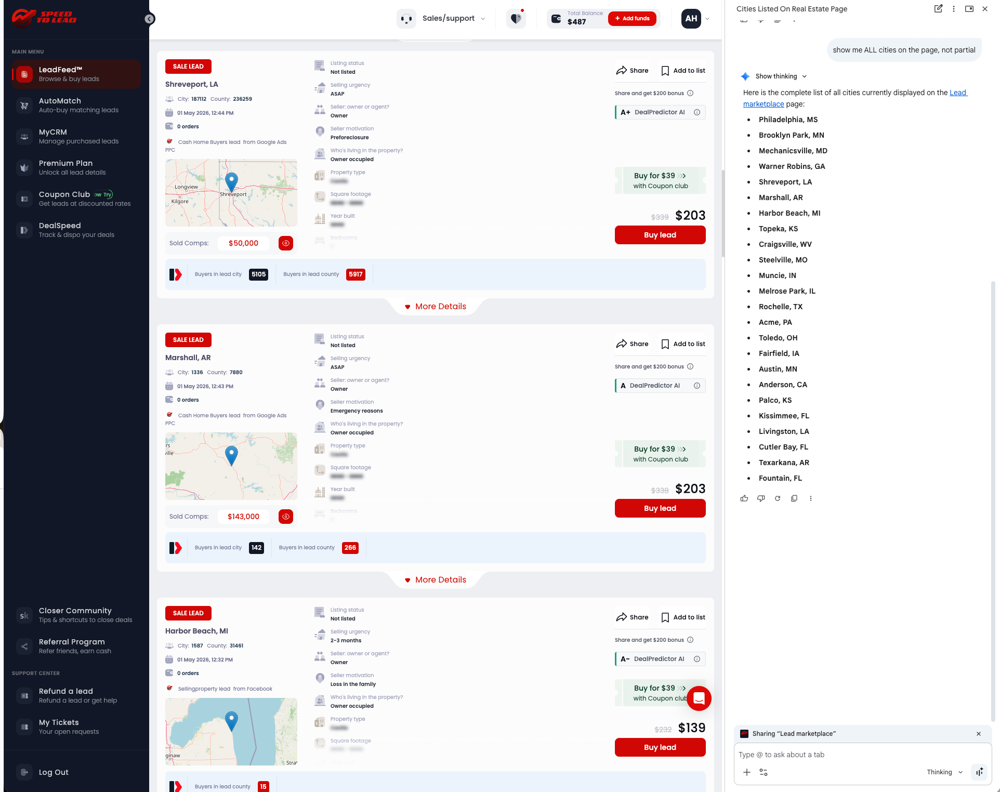
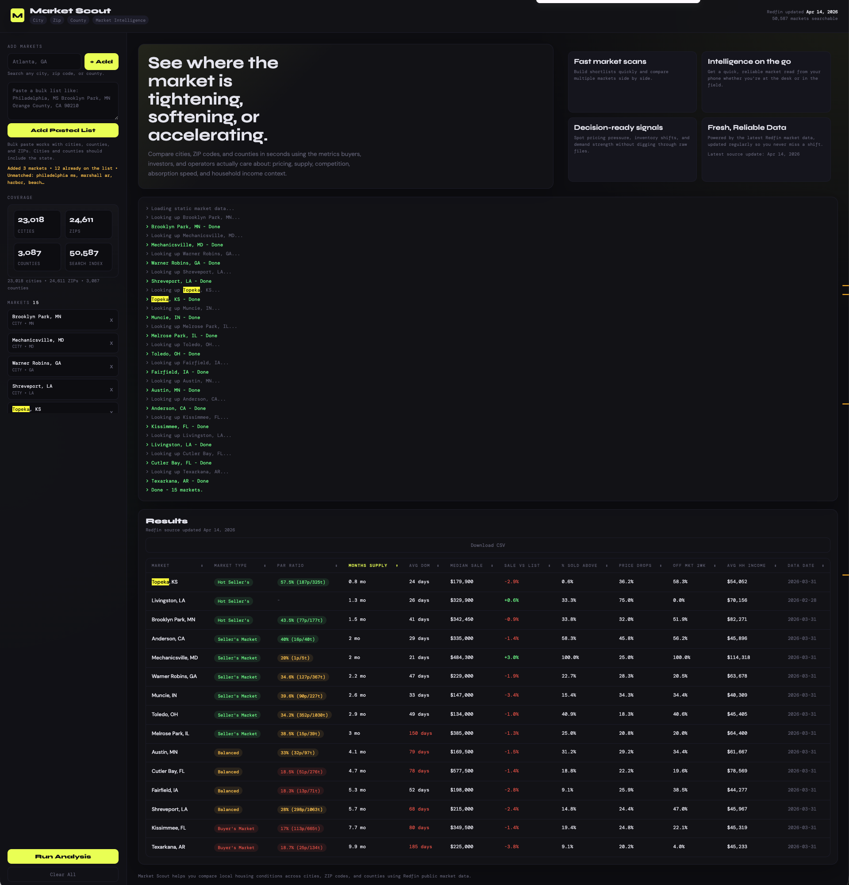

# Market Scout

Market Scout is a real estate market intelligence app that turns Redfin public market-tracker
data into a fast comparison workflow for US cities, ZIP codes, and counties. I first built it
as a local Python/Flask tool, then refactored it into a static web product backed by a Python
build pipeline, sharded JSON artifacts, GitHub Actions refreshes, and Cloudflare Pages hosting.

- Live demo: [market-scout-anl.pages.dev](https://market-scout-anl.pages.dev/)
- Architecture docs: [docs/architecture.md](docs/architecture.md)
- ADR index: [docs/adrs/README.md](docs/adrs/README.md)

## Screenshots

Market shortlist workflow:



Sorted comparison results:



## About

Market Scout is designed to help an operator, investor, or analyst answer a simple question
quickly: which markets are worth deeper attention, and which ones should be filtered out early.

What the product does:

- compares cities, ZIP codes, and counties side by side
- surfaces pricing, supply, speed, and demand signals from Redfin public data
- supports bulk market paste, sortable results, and CSV export
- links directly into Zillow and Redfin once a market survives the first-pass screen
- enriches results with Census ACS household-income context

Why it exists:

- buying is not the finish line; exiting is
- a deal that looks good in isolation can become hard to unwind in a slow market with stacked
  inventory and weak absorption
- Market Scout reduces the time spent sorting through leads by surfacing those conditions early

## Tech Stack

| Area | Tools |
| --- | --- |
| Frontend | HTML, CSS, vanilla JavaScript |
| Data pipeline | Python 3, `gzip`, JSON artifact generation |
| Local runtime | Flask |
| Automation | GitHub Actions |
| Hosting | Cloudflare Pages |
| Data sources | Redfin Market Tracker, US Census ACS |

## Engineering Highlights

- Refactored a local Flask workflow into a static web architecture to hit a near-zero monthly
  hosting target without changing the core product use case.
- Built a shared Python parsing layer in [market_data.py](market_data.py) that is reused by both
  the legacy Flask runtime and the static-site build pipeline.
- Streams large Redfin source files to disk, keeps only the latest `All Residential` row per
  market, and emits compact browser-friendly artifacts instead of shipping raw datasets to the
  frontend.
- Uses a prebuilt search index plus per-state JSON shards so the deployed site can stay static
  while still supporting fast market lookup across cities, ZIP codes, and counties.
- Preserves product-oriented UX features in a no-backend deployment model: bulk paste, sortable
  results, CSV export, upstream freshness metadata, and Zillow/Redfin drill-through links.
- Keeps the original local app path available for development and comparison while the public
  production path runs as a static deployment.

## Architecture

The production system is intentionally split between build-time data preparation and a static
browser runtime:

- Redfin data is downloaded and normalized at build time by [scripts/build_static_data.py](scripts/build_static_data.py)
- the deployable site is assembled by [scripts/build_static_site.py](scripts/build_static_site.py)
- Cloudflare Pages serves static assets from `dist/`
- the browser loads a search index plus lazy per-state market shards from `dist/data/`
- household-income lookups are fetched from the Census API at runtime in the browser

For the full system view, see:

- [docs/architecture.md](docs/architecture.md)
- [docs/adrs/README.md](docs/adrs/README.md)
- [docs/cloudflare-pages-setup.md](docs/cloudflare-pages-setup.md)

## Local Development

### Requirements

- Python 3.8+
- `pip3`

### Install dependencies

```bash
pip3 install flask playwright playwright-stealth
python3 -m playwright install chromium
```

Or use the included setup script:

```bash
bash setup.sh
```

### Run the local Flask app

```bash
python3 app.py
```

Then open:

- [http://127.0.0.1:8080](http://127.0.0.1:8080)

On macOS you can also use the launcher:

```bash
bash launch.sh
```

## Static Web Build

### 1. Build static data artifacts

```bash
python3 scripts/build_static_data.py
```

This step:

- downloads or reuses cached Redfin source files
- fetches upstream metadata such as `Last-Modified`
- keeps only the latest row per supported market
- writes manifests, a search index, and per-state market shards under `generated/web-data/`

### 2. Assemble the deployable site

```bash
python3 scripts/build_static_site.py
```

This step:

- copies frontend assets from `static/`
- copies generated artifacts into `dist/data/`
- produces a deployable static site under `dist/`

### Preview locally

```bash
python3 -m http.server 8000 --directory dist
```

Then open:

- [http://127.0.0.1:8000](http://127.0.0.1:8000)

## Deployment Model

### Cloudflare Pages

If Cloudflare Pages is building directly from GitHub, use:

- Build command: `bash scripts/build_cloudflare_pages.sh`
- Build output directory: `dist`

### Scheduled refreshes

The repository includes a GitHub Actions workflow at
[.github/workflows/static-site.yml](.github/workflows/static-site.yml) that can rebuild the site
from the latest Redfin public files on a monthly schedule.

Important distinction:

- Cloudflare Git integration can keep the site deployed
- GitHub Actions is what enables unattended monthly data rebuilds and deploys

## Data Handling

- Production deployment is a static site; the app does not implement user accounts or its own
  server-side database.
- Market metrics come from Redfin public market-tracker datasets.
- Household-income values are fetched from the US Census ACS API at runtime in the browser.
- The local Flask app can fetch Redfin and Census data directly for local/dev usage.

## Limitations

- Freshness follows the latest public Redfin release and rebuild cadence; this is not live MLS
  data.
- ZIP codes are smaller geographic areas, so some metrics such as months of supply or price
  drops can be unavailable or less stable than city- or county-level readings.
- Household-income values are ACS survey estimates, not real-time local earnings data.
- The public web version is intentionally static, so server-side personalization and persistent
  user state are out of scope for the current architecture.

## Project Structure

```text
app.py                             Legacy/local Flask app
market_data.py                     Shared dataset parsing and artifact generation logic
static/index.html                  Static production UI
scripts/build_static_data.py       Build Redfin-derived web artifacts
scripts/build_static_site.py       Assemble deployable site into dist/
scripts/build_cloudflare_pages.sh  Cloudflare Pages build entrypoint
.github/workflows/static-site.yml  Scheduled build/deploy workflow
docs/architecture.md               Architecture overview and container diagram
docs/adrs/                         Concise architecture decision records
docs/web-migration-plan.md         Migration notes
docs/cloudflare-pages-setup.md     Deployment setup notes
```

## Additional Documentation

- [docs/architecture.md](docs/architecture.md)
- [docs/adrs/README.md](docs/adrs/README.md)
- [docs/adr/0001-web-hosting-and-cost-strategy.md](docs/adr/0001-web-hosting-and-cost-strategy.md)
- [docs/web-migration-plan.md](docs/web-migration-plan.md)
- [docs/cloudflare-pages-setup.md](docs/cloudflare-pages-setup.md)

## License

MIT
