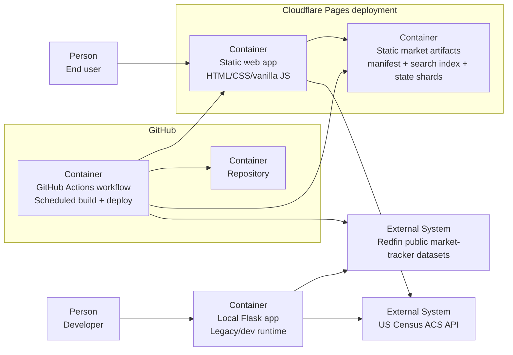

# Architecture

## Overview

Market Scout has two runtime shapes:

- a **public production path** built as a static site
- a **local development path** built around Flask

The important architectural decision is that Redfin market data is normalized at build time,
not parsed on every request. That keeps the public deployment cheap, predictable, and easy to
host on static infrastructure.

## C4-Style Container Diagram

## Runtime Flow

### Production path

1. `scripts/build_static_data.py` downloads or reuses Redfin source datasets.
2. `market_data.py` parses the gzip files, keeps only the latest `All Residential` row per
   market, and computes the compact fields used by the UI.
3. The build writes:
   - `manifest.json`
   - `search-index.json`
   - top-level dataset manifests
   - per-state market shards under `markets/<type>/<state>.json`
4. `scripts/build_static_site.py` copies the frontend and generated data into `dist/`.
5. Cloudflare Pages serves the static site from `dist/`.
6. The browser loads the search index, fetches only the needed market shard, and calls the
   Census ACS API for household-income enrichment.

### Local development path

1. `app.py` loads the same Redfin datasets through `market_data.py`.
2. Flask serves the local UI and handles lookup logic in-process.
3. Census income lookups are performed server-side in the Flask app.

## Deployment Shape

Production deployment is intentionally simple:

- **Hosting:** Cloudflare Pages
- **Build entrypoint:** `bash scripts/build_cloudflare_pages.sh`
- **Deploy artifact:** `dist/`
- **Refresh automation:** GitHub Actions on `push`, `workflow_dispatch`, and monthly `schedule`

The repository supports two practical deployment modes:

- **Cloudflare Git integration:** Cloudflare builds `dist/` directly from the repo
- **GitHub Actions direct upload:** GitHub Actions builds `dist/` and deploys it with Wrangler

## Key Constraints

- **Large upstream data:** Redfin source files are large enough that request-time or startup-time
  parsing is the wrong cost model for production.
- **Low-cost target:** the public version was designed around near-zero recurring infrastructure
  cost.
- **Static-first runtime:** production intentionally avoids a long-lived backend process.
- **Data freshness:** the product reflects the latest public Redfin release plus rebuild cadence,
  not live MLS updates.
- **Metric stability by geography:** ZIP-level metrics can be missing or less stable because the
  underlying geography is smaller.

## Why This Is Technically Credible

- The same parsing logic serves both the local Flask app and the static production build.
- The build pipeline captures upstream freshness metadata and ships it with the frontend.
- Search and market lookup are separated: a lightweight index is loaded first, and heavier market
  data is fetched lazily by state shard.
- The production deployment model matches the product economics instead of forcing a backend where
  one is not needed.
